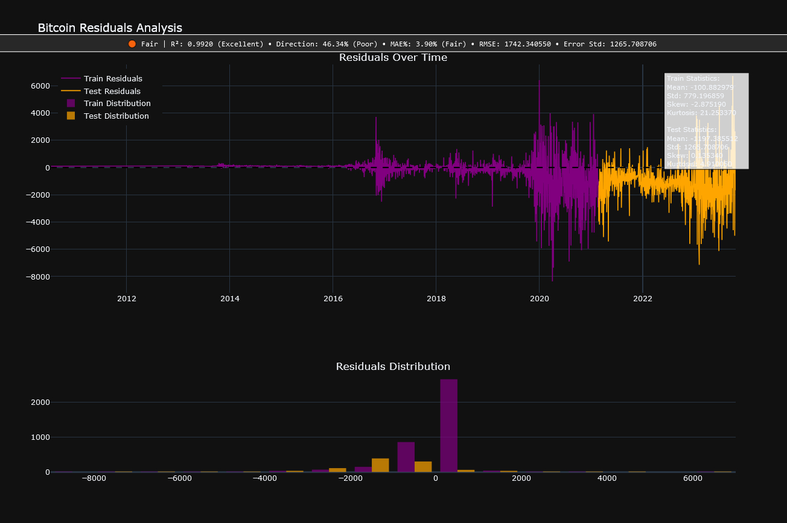

# Machine Learning Stock and Cryptocurrency Analysis Script

## Script Overview

This script is a powerful, configurable framework designed to analyze stock and cryptocurrency data using modern machine learning techniques. It provides the following features:

## Key Features:

### Data Handling and Preprocessing:
- Supports both stock and cryptocurrency datasets.
- Handles missing values, resamples data to different timeframes, and computes technical indicators such as MACD, Bollinger Bands, and Stochastic Oscillators.
- Incorporates crypto-specific constraints like market capitalization for validation.

### Model Building and Training:
- Offers flexibility to configure model architectures, including time-step settings, dropout rates, hidden layer sizes, and future prediction steps.
- Includes support for attention layers and raw feature extraction for more nuanced learning.

### Prediction and Validation:
- Generates price predictions for stocks and cryptocurrencies.
- Validates cryptocurrency predictions to ensure alignment with realistic market behavior, such as limiting price fluctuations to a maximum percentage change.

### Evaluation and Metrics:
- Computes evaluation metrics like MAE, RMSE, R², and directional accuracy.
- Logs detailed metrics for training and testing performance.

### Interactive Visualizations:
- Provides rich, interactive visualizations using Plotly, including:
  - Residual analysis with time-series and distribution plots.
  - Advanced indicators like MACD, volume correlation, and stochastic oscillators.
  - Detailed dashboards for price prediction analysis.
  - Crypto-specific visualizations incorporating market capitalization trends.

### Custom Configuration Options:
- Allows users to create new models or load existing ones.
- Offers customization of train-test splits, learning rates, epochs, batch sizes, and more.
- Built with reproducibility in mind, enabling global random seed settings.

### Future Predictions:
- Predicts future price trends for configurable time steps with advanced plotting of error bands and detailed analysis.


# Docker Setup and Usage for Machine Learning Stock and Cryptocurrency Analysis Script

## Docker Instructions

### Prerequisites
Ensure you have Docker installed on your system. You can download Docker from [Docker's official website](https://www.docker.com/).

### Build the Docker Image
To build the Docker image, navigate to the directory containing your Dockerfile and run:

```bash
# Rebuild the Docker Image
$ docker build -t lstm-crypt-stocks .
```

### Running the Docker Container

#### 1. Default Output to Current Directory
To run the Docker container and save the output to the same folder where the Docker script is being executed:

**Windows (PowerShell):**
```bash
$ docker run -it --name lstm-container -v ${PWD}:/host/root lstm-crypt-stocks lstm
```

**Linux/Mac:**
```bash
$ docker run -it --name lstm-container -v $(pwd):/host/root lstm-crypt-stocks lstm
```

#### 2. Save Output to Desktop
If you want to save the output to the Desktop:

**Windows (PowerShell):**
```bash
$ docker run -it --name lstm-container -v C:\Users\<username>\Desktop:/host/desktop lstm-crypt-stocks lstm
```

**Linux/Mac:**
```bash
$ docker run -it --name lstm-container -v ~/Desktop:/host/desktop lstm-crypt-stocks lstm
```

### Reusing the Docker Container
Instead of creating a new container each time, you can reuse an existing container:

```bash
# Restart and attach to the existing container
$ docker start -ai lstm-container
```

### Removing the Docker Container
If you need to remove the container:

#### 1. List All Containers
```bash
$ docker ps -a
```

#### 2. Remove a Specific Container by Name
```bash
$ docker rm lstm-container
```

#### 3. Remove All Stopped Containers (Optional)
```bash
$ docker container prune -f
```

### Data Directory Structure:
- Stock data is expected in the directory: `/data/stocks/<stock_name>/<file_name>.csv`
- Cryptocurrency data is expected in the directory: `/data/crypto/<crypto_name>/<file_name>.csv`

### Data:
- Stock CSV File: [Yahoo Finance](https://finance.yahoo.com/)
- Cryptocurrency CSV File: [CoinMarketCap](https://coinmarketcap.com/)

### Required File Formats:
- **Stock CSV File**:
  ```
  Date,Open,High,Low,Close,Adj Close,Volume
  ```
- **Cryptocurrency CSV File**:
  ```
  timeOpen;timeClose;timeHigh;timeLow;name;open;high;low;close;volume;marketCap;timestamp
  ```

## How to Run the Script - you don't need Docker

### Prerequisites
1. Install Python 3.10.5.
2. Init venv: ```py -3 -m venv project_name``` or ```py -3.x -m venv project_name```
3. Navigate to your folder Scripts and type in the terminal:
   1. .\Scripts\Activate.ps1
   2. or ```deactivate``` if you wanna stop venv
   3. If cannot run from PowerShell
      1. ```Set-ExecutionPolicy -Scope Process -ExecutionPolicy Bypass;``` 
      2. ```.\Scripts\Activate.ps1```
4. Install the required dependencies by running the following command:
   ```bash
   pip install -r requirements.txt
   ```

### Running the Script
To run the script, use the following command in the terminal:
```bash
python .\lstm_ai_v24_7_daily_b.py
```

### Output Directory
- The script automatically generates an output directory in the same location as the script. 
- This directory contains:
  - **Visualizations**: Interactive plots in HTML format.
  - **Logs**: Detailed training, evaluation, and prediction logs.
  - **Saved Models**: Serialized model files for future use.
  - **Metrics Reports**: CSV files summarizing performance metrics.

Ensure that the script has appropriate permissions to create directories and write files in its directory.

### Important Notes
- **Default Output Location:** By default, the script saves outputs in the root directory where the Docker container is run.
- **Persisting Data:** Reuse the Docker container (`docker start -ai lstm-container`) to retain models and data generated in `/app/LSTM/v24_b/lstm_ai_v24_7_daily_b`.
- **Updating Data:** To update cryptocurrency or stock data, rebuild the Docker image with the latest data or remove and rebuild the container to create a fresh instance.

## Dependencies

This script requires the following libraries and versions:

```plaintext
Package            Version
------------------ -----------
async-timeout      5.0.1
beautifulsoup4     4.12.3
certifi            2024.8.30
charset-normalizer 3.4.0
choreographer      0.99.6
colorama           0.4.6
contourpy          1.3.1
cycler             0.12.1
filelock           3.16.1
fonttools          4.55.0
frozendict         2.4.6
fsspec             2024.10.0
html5lib           1.1
idna               3.10
Jinja2             3.1.4
joblib             1.4.2
kaleido            0.4.1
kiwisolver         1.4.7
lxml               5.3.0
MarkupSafe         3.0.2
matplotlib         3.9.2
mplfinance         0.12.10b0
mpmath             1.3.0
multitasking       0.0.11
networkx           3.4.2
numpy              2.1.3
packaging          24.2
pandas             2.2.3
patsy              1.0.1
peewee             3.17.8
pillow             11.0.0
pip                22.0.4
platformdirs       4.3.6
plotly             5.24.1
pyparsing          3.2.0
python-dateutil    2.9.0.post0
pytz               2024.2
requests           2.32.3
scikit-learn       1.5.2
scipy              1.14.1
setuptools         58.1.0
six                1.16.0
soupsieve          2.6
statsmodels        0.14.4
sympy              1.13.1
tenacity           9.0.0
threadpoolctl      3.5.0
torch              2.5.1
tqdm               4.67.0
typing_extensions  4.12.2
tzdata             2024.2
urllib3            2.2.3
webencodings       0.5.1
yfinance           0.2.50
```

### Future Enhancements
Future updates will aim to:
1. Improve Docker automation for easier handling of data updates.
2. Provide advanced configurations for output management directly within the Docker container.

### Feature Development:
- **Web Interface**: Plans to integrate a web-based UI for easier interaction, visualization, and analysis.

## Disclaimer

This script is developed exclusively for educational and learning purposes. It is designed to demonstrate the principles of financial data analysis, machine learning, and data visualization.

### Important Notes:
- **Not Suitable for Real Trading**: The predictions and metrics generated by this script are hypothetical and based on historical data. They are not intended for real-world trading or investment activities.
- **No Financial Advice**: The author of this script does not provide financial or investment advice. Users of this script should not make financial decisions based on its outputs.
- **Potential Risks**: Financial markets are unpredictable and involve significant risks. Utilizing machine learning models in trading without thorough validation and professional guidance can lead to substantial financial losses.

### Why This Disclaimer Matters:
The complexities of financial markets and the limitations of machine learning models necessitate caution. This script is a learning tool and should not be relied upon for actual trading purposes.

If you choose to use or modify this script, it is your responsibility to ensure compliance with applicable regulations and to seek advice from licensed financial professionals. The author disclaims any liability for losses or damages incurred through the use of this script.

## Example Output
### Price Prediction Analysis


### Price Prediction Analysis


### Residual Over Time


### Residual Diagnostics


### Price vs Prediction

